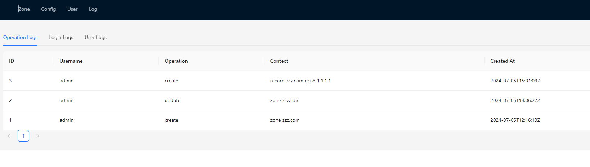

# bind9-manager-front

This frontend project provides a simple web interface for managing Bind9 using the Vite framework.

### Example

admin/admin




### Usage

Build Docker Image

```
docker build -t bind9-manager-front:v1 .
```

Run Docker Container

```
docker run --name bind9-manager-front \
  --link bind9-manager-service:bind9-manager-service \
  --restart always \
  -p 80:80 \
  -d bind9-manager-front:v1
```

Usage with Kubernetes

```
# modify bind9-manager-front.yaml
kubectl -n xxx apply -f bind9-manager-front.yaml
```
